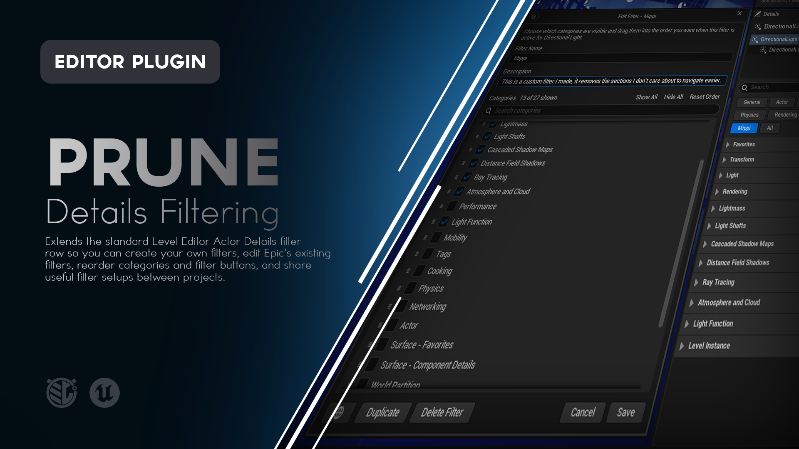

# Prune

**Take control of Unreal Engine's Actor Details panel with editable category filters.**

Prune extends the standard Level Editor Actor Details filter row so you can create your own category filters, edit Epic's existing filters, reorder categories, organize filter buttons, and move useful filter setups between projects.

It works directly with Unreal Engine's native Details panel instead of replacing it.




---

## What is Prune?

Unreal Engine's Details panel can become difficult to scan once an Actor exposes a large number of categories.

A gameplay Actor might contain:

```text
Transform
Actor
Rendering
Collision
Physics
Networking
Movement
Interaction
Audio
Debug
Gameplay
Components
Project Settings
```

Unreal's built-in Property Section filters help, but those filters are defined around general-purpose category groupings.

The categories you need depend on what you are doing.

A gameplay designer may care about:

```text
Transform
Movement
Interaction
Gameplay
Collision
```

An environment artist may care about:

```text
Transform
Rendering
Materials
Lighting
LOD
```

Prune lets you create those views directly inside the normal Actor Details panel.

You can:

- Create custom filters.
- Choose exactly which Details categories appear.
- Reorder categories inside each filter.
- Edit Epic's existing filters.
- Duplicate Epic filters into independent Prune filters.
- Scope filters to one Actor class or make them Global.
- Reorder filter buttons per Actor class.
- Add descriptions.
- Import and export reusable filter presets.
- Manage everything from the same Details workflow you already use.

Prune changes **how properties are presented**, not the Actor or its properties.

---

# Features

### Custom Details Filters

Create your own named filters directly from the Actor Details filter row.

Choose which categories should appear whenever that filter is active.

### Editable Epic Filters

Prune can customize existing Epic Property Section filters such as:

- General
- Actor
- LOD
- Misc
- Physics
- Rendering
- Streaming

Prune stores an override rather than permanently replacing the underlying Epic definition.

Use **Reset to Epic Default** at any time to remove the Prune override.

### Class and Global Scope

Each custom filter or Epic override can be scoped as:

**Class**

Available to the current Actor class and inherited by derived Actor classes.

**Global**

Available across Actor classes.

### Category Reordering

Control the order categories appear while a particular filter is active.

Each editable filter can have its own category order.

### Filter Button Reordering

Use the Filter Manager to arrange filter buttons into the order that makes sense for the current Actor class.

### Filter Manager

Search, inspect, edit, duplicate, reset, delete, import, export, and reorder filters from one management window.

### Duplicate Filters

Duplicate an existing custom filter or Epic filter into a new independent Prune filter.

Duplicate names are created safely using names such as:

```text
Gameplay Copy
Gameplay Copy 2
Gameplay Copy 3
```

### Descriptions

Add an optional description to a Prune filter.

Descriptions are visible in the Filter Manager and can appear as filter-button tooltips.

### Right-Click Filter Menus

Right-click compatible filter buttons for contextual actions such as:

- Edit
- Duplicate
- Export
- Delete
- Reset
- Filter Manager
- Settings

### Portable Import and Export

Export custom Prune filters to portable:

```text
.prunefilters.json
```

files.

Import them into another project or another Actor class.

### Native Filter Behavior

Normal left-click and Ctrl-click behavior remains Unreal-owned.

Prune extends the filter workflow without replacing the native filter system.

### Plugin Category Support

Prune discovers the finished Actor Details category layout after customizations have run.

Categories added by editor customizations can therefore participate when they are present in the Actor Details layout.

### Persistent Per-Project Editor State

Prune remembers:

- Custom filters
- Filter descriptions
- Global or Class scope
- Category visibility
- Category order
- Epic overrides
- Filter-button ordering

### Configurable Appearance

Customize drag-and-drop feedback and default Prune window sizes through Project Settings.

### Editor Only

Prune adds no runtime gameplay systems and has no impact on packaged game behavior.

---
<!--
> [!IMPORTANT]
> **ATTENTION - README AUTHOR**
>
> Capture the main Prune workflow here.
>
> **Recommended visual:** GIF
>
> Show:
>
> 1. A complex Actor with many Details categories.
> 2. Click the Prune **+** button.
> 3. Name the new filter.
> 4. Uncheck several categories.
> 5. Reorder two or three categories.
> 6. Save.
> 7. Show the new filter appear in the native filter row.
> 8. Click it and show the Details panel immediately simplify.
>
> Keep the Details panel large enough that the category changes are easy to see.
>
> Around 10 to 15 seconds is ideal.
>
> **Suggested file:**
>
> `Doc/Images/Prune-Create-Filter.gif`
>
> Once captured, replace this callout with:
>
> ```markdown
> 
> ```
-->
---

# Using Prune

Prune integrates directly into the standard Level Editor Actor Details filter area.

Beside Unreal's normal filter buttons, Prune adds three compact controls.

### New Filter

The **+** button creates a new Prune filter.

### Filter Manager

Opens the Filter Manager for the currently selected Actor class.

### Edit Filter

Edits the single currently active editable filter.

The Edit control is disabled when:

- All is active.
- Multiple filters are selected with Ctrl.
- The active filter is not editable.

---
<!--
> [!IMPORTANT]
> **ATTENTION - README AUTHOR**
>
> Capture an annotated screenshot of the Prune filter controls.
>
> **Recommended visual:** Screenshot
>
> Crop tightly around the Actor Details filter row.
>
> Label:
>
> 1. Epic Filters
> 2. Custom Prune Filter
> 3. New Filter
> 4. Filter Manager
> 5. Edit Active Filter
> 6. All
>
> Use a real Actor with several custom filters already created.
>
> **Suggested file:**
>
> `Doc/Images/Prune-Controls.png`
>
> Once captured, replace this callout with:
>
> ```markdown
> 
> ```
-->
---

# Creating a Filter

Select an Actor in the Level Editor and click the Prune:

**+**

button.

The New Filter window lets you configure:

- Filter name
- Description
- Global or Class scope
- Visible categories
- Category order

---

## Filter Name

Give the filter a meaningful workflow name.

Examples:

```text
Gameplay
Lighting
Environment
Networking
Debug
Core Setup
Interaction
```

The name becomes a button in the normal Actor Details filter row.

---

# Choosing Categories

Every Details category Prune has discovered for the current Actor appears in the filter editor.

Check a category to include it.

Uncheck it to hide it from that filter.

For example:

```text
Gameplay Filter

[x] Transform
[x] Movement
[x] Interaction
[x] Collision
[x] Gameplay
[ ] Rendering
[ ] Physics
[ ] Networking
[ ] Debug
```

Saving the filter does not remove those hidden properties.

They simply do not appear while that filter is active.

Switch to another filter or **All** to access them normally.

---

# Searching Categories

The filter editor includes category search.

Use it to find categories by their displayed name when working with Actors that expose a large Details layout.

Search only changes what is visible inside the filter editor.

It does not change which categories are currently enabled.

---

# Category Ordering

Drag category rows inside the filter editor to change their presentation order.

For example:

```text
Before

Gameplay
Interaction
Transform
Movement
Collision
```

can become:

```text
Transform
Movement
Interaction
Gameplay
Collision
```

That ordering applies whenever the filter is active.

Each filter can maintain a different category order.
<!--
> [!IMPORTANT]
> **ATTENTION - README AUTHOR**
>
> Capture category reordering here.
>
> **Recommended visual:** GIF
>
> Show the filter editor containing at least 8 categories.
>
> Demonstrate:
>
> 1. Drag one category upward.
> 2. Show the dragged-row visual feedback.
> 3. Show the insertion line.
> 4. Drop the category.
> 5. Save the filter.
> 6. Show the Details categories using the new order.
>
> **Suggested file:**
>
> `Doc/Images/Prune-Category-Order.gif`
>
> Once captured, replace this callout with:
>
> ```markdown
> 
> ```
-->
---

# Unknown and Newly Discovered Categories

A saved filter may later encounter a Details category that did not exist when the filter was created.

Prune does not silently discard it.

Categories explicitly arranged by the user follow the saved order.

Newly encountered categories remain available and fall after the stored entries using Unreal's normal relative order.

This allows filters to remain useful as Actor classes and editor customizations evolve.

---

# Duplicate Display Names

Unreal can expose more than one internal category using the same visible label.

For example:

```text
Transform
TransformCommon
```

may effectively represent one visible category row.

Prune groups duplicate visible labels together in the filter editor so they move as one user-facing category instead of exposing implementation details that do not matter to the user.

---

# Class Scope

A Class filter belongs to the current Actor class.

Derived classes inherit it through Unreal Engine's normal Property Section class hierarchy.

For example:

```text
AEnemy
└── ABossEnemy
```

A Class filter created for:

```text
AEnemy
```

can also apply to:

```text
ABossEnemy
```

unless a more specific configuration changes that workflow.

This is useful when a filter only makes sense for one family of Actors.

---

# Global Scope

Enable the **Global** scope control to make a filter available across Actor classes.

Global filters are useful for broad workflows such as:

```text
Rendering
Debug
Networking
Transform
Lighting
```

where the same view may be useful on many different Actor types.

---
<!--
> [!IMPORTANT]
> **ATTENTION - README AUTHOR**
>
> Capture the Class / Global scope control here.
>
> **Recommended visual:** Screenshot
>
> Show the New Filter or Edit Filter window with the scope control visible.
>
> Ideally capture it while Class-scoped so the tooltip explains the current Actor class and derived-class behavior.
>
> **Suggested file:**
>
> `Doc/Images/Prune-Scope.png`
>
> Once captured, replace this callout with:
>
> ```markdown
> 
> ```
-->
---

# Editing a Filter

Activate one editable filter and click the Prune Edit control.

You can change:

- Description
- Scope
- Category visibility
- Category order

Custom Prune filters can also be:

- Duplicated
- Deleted

Epic filters have a slightly different workflow because their underlying definition belongs to Unreal Engine.

---

# Editing Epic Filters

Prune can edit compatible Epic filters such as:

```text
General
Actor
LOD
Misc
Physics
Rendering
Streaming
```

The Epic filter's name remains read-only.

You can customize:

- Description
- Scope
- Category visibility
- Category order

Prune stores those changes as an **override**.

It does not permanently replace Epic's original definition.

---

# Reset to Epic Default

When an Epic filter has a Prune override, use:

**Reset to Epic Default**

to remove the applicable Prune override.

The filter immediately returns to the underlying Unreal Engine behavior.

This makes Epic filters safe to experiment with because the original definition remains available underneath the Prune customization.

---

# Duplicating an Epic Filter

If an Epic filter is close to what you want but should remain independent, choose:

**Duplicate**

Prune creates a new custom filter prefilled from the Epic filter's current configuration.

The new filter is owned entirely by Prune and can then be:

- Renamed
- Reordered
- Exported
- Deleted
- Edited independently

The original Epic filter remains unchanged.

---

# Descriptions

Custom Prune filters can include optional descriptions.

For example:

```text
Gameplay

Common gameplay-facing properties used during encounter setup.
```

Descriptions appear in the Filter Manager.

When enabled in Project Settings, they also appear when hovering filter buttons in Actor Details.

This is useful when filter names are intentionally short but the workflow they represent needs more context.

---

# Filter Manager

The **Filter Manager** provides a complete view of the filters available to the current Actor class.

Each row can show information such as:

```text
Prune | Class: BP_Enemy | 6/14 Categories
```

```text
Prune | Global | 8/14 Categories
```

```text
Epic | 5/14 Categories
```

```text
Epic Override | Global | 4/14 Categories
```

The currently active filter is also identified.

From the Filter Manager you can:

- Search filters
- Create filters
- Edit filters
- Duplicate filters
- Reset Epic overrides
- Delete custom filters
- Import filters
- Export filters
- Reorder filter buttons
- Reset filter-button order
<!--
> [!IMPORTANT]
> **ATTENTION - README AUTHOR**
>
> Capture the Filter Manager here.
>
> **Recommended visual:** Screenshot
>
> Set up enough filters to show several states:
>
> - Epic
> - Epic Override
> - Prune Global
> - Prune Class
> - Active filter
> - Filters with descriptions
>
> Make sure the lower controls are visible:
>
> - New Filter
> - Import
> - Export
> - Reset Button Order
> - Done
>
> **Suggested file:**
>
> `Doc/Images/Prune-Filter-Manager.png`
>
> Once captured, replace this callout with:
>
> ```markdown
> 
> ```
-->
---

# Reordering Filter Buttons

Filter buttons do not need to remain in Unreal's original order.

Open the Filter Manager and drag filters into the order you want.

For example:

```text
General
Actor
Gameplay
Rendering
Debug
All
```

might become:

```text
Gameplay
Debug
General
Actor
Rendering
All
```

The order is remembered for that Actor class.

Changes apply immediately.

---

## Reset Button Order

Click:

**Reset Button Order**

to remove the custom order for the current Actor class.

The filter row returns to Unreal's normal ordering.

The button is disabled when the current class does not have a custom order.

---

# Right-Click Filter Menus

Right-click an editable filter button to access contextual Prune actions.

Depending on the type and state of the filter, the menu can include:

```text
Edit
Duplicate
Export
Delete
Reset
Filter Manager
Settings
```

This provides quick access to common operations without opening the Filter Manager first.

Normal left-click and Ctrl-click behavior remains native Unreal behavior.

---

# Multiple Active Filters

Unreal Engine allows several Property Section filters to be combined using Ctrl.

Prune preserves that behavior.

When several filters are active together:

- Unreal controls the combined category visibility.
- The Prune Edit button is disabled.
- Custom category ordering is not imposed.
- Unreal's normal category order is used.

This prevents one filter's custom order from arbitrarily winning when several independent filters are active at the same time.

---

# Import and Export

Prune custom filters can be moved between projects using portable JSON files.

The file extension is:

```text
.prunefilters.json
```

---

## Exporting Filters

Open the Filter Manager and click:

**Export**

Prune exports the custom filters available to the current Actor class.

Exported data includes:

- Filter name
- Description
- Global or Class scope
- Hidden category IDs
- Category order

Epic filters are not exported directly because their definitions are owned by Unreal Engine.

If you want an Epic filter to become a portable Prune preset, duplicate it first.

---

## Exporting One Filter

A custom Prune filter can also be exported directly from its right-click context menu.

---

# Importing Filters

Open the Filter Manager and click:

**Import**

Choose a valid `.prunefilters.json` file.

When imported:

- Global filters remain Global.
- Class-scoped filters are mapped to the Actor class currently being managed.
- Imported filters receive new internal IDs.
- Existing filters are never silently overwritten.
- Name collisions receive collision-safe Copy names.

For example:

```text
Gameplay
Gameplay Copy
Gameplay Copy 2
```

---

# Import Validation

Prune validates imported files before changing local filter state.

It safely handles situations such as:

- Invalid JSON
- Unsupported format versions
- Empty files
- Missing filter data
- Partial filter entries
- Invalid filter names

A bad import should not partially corrupt the existing filter collection.
<!--
> [!IMPORTANT]
> **ATTENTION - README AUTHOR**
>
> A visual is optional here.
>
> If you want one, use a short GIF showing:
>
> 1. Export a Gameplay filter.
> 2. Open another Actor class or project.
> 3. Import the `.prunefilters.json`.
> 4. Show the filter appear.
>
> **Suggested file:**
>
> `Doc/Images/Prune-Import-Export.gif`
>
> Once captured, replace this callout with:
>
> ```markdown
> 
> ```
-->
---

# Project Settings

Open:

**Project Settings > Plugins > Prune**

to customize Prune.

Available settings include:

| Setting | Default | Purpose |
|---|---:|---|
| **Reorder Drag Color** | Blue | Background color of a row being dragged. |
| **Dragged Content Color** | White | Text, checkbox, and grip color while dragging. |
| **Drop Line Color** | Blue | Color of the category or filter insertion line. |
| **Drop Line Thickness** | 2.0 | Thickness of the reorder insertion line. |
| **Filter Editor Default Width** | 560 | Default width of New/Edit Filter windows. |
| **Filter Editor Default Height** | 640 | Default height of New/Edit Filter windows. |
| **Show Description Tooltips** | On | Displays descriptions when hovering Prune filter buttons. |
| **Filter Manager Default Width** | 680 | Default Filter Manager width. |
| **Filter Manager Default Height** | 620 | Default Filter Manager height. |

Prune windows remain freely resizable.
<!--
> [!IMPORTANT]
> **ATTENTION - README AUTHOR**
>
> Capture the Prune Project Settings here.
>
> **Recommended visual:** Screenshot
>
> Show:
>
> **Project Settings > Plugins > Prune**
>
> Make sure all three groups are visible:
>
> - Filter Editor Reordering
> - Filter Editor Window
> - Filter Bar
> - Filter Manager Window
>
> This is optional because the settings table already explains the available configuration.
>
> **Suggested file:**
>
> `Doc/Images/Prune-Settings.png`
>
> Once captured, replace this callout with:
>
> ```markdown
> 
> ```
-->
---

# Example Workflow

Imagine `BP_Enemy` exposes:

```text
Transform
Actor
Rendering
Collision
Physics
Networking
Movement
AI
Combat
Interaction
Audio
Debug
Loot
Animation
```

Different developers need different views of that Actor.

A gameplay designer might create:

```text
Gameplay

Transform
Movement
AI
Combat
Interaction
Loot
```

A technical artist might create:

```text
Visuals

Transform
Rendering
Animation
Audio
```

A network-focused developer might create:

```text
Networking

Actor
Networking
Movement
Combat
```

Those workflows all use the same Actor.

Prune simply lets each workflow expose the categories that matter for the task being performed.

---

# Saving Prune Settings

Prune stores its editor-only filter state in:

```text
EditorPerProjectUserSettings.ini
```

Saved state includes:

- Custom filter definitions
- Descriptions
- Scope
- Hidden categories
- Category order
- Epic overrides
- Per-class filter-button order

Prune does not store this information on the Actor itself.

Changing a Prune filter does not modify gameplay data.

---

# Installation

Prune can be installed through **Fab**, from a **GitHub Release**, or directly from the **GitHub source**.

For most users, Fab or a GitHub Release is recommended.

---

## Fab / Epic Games Launcher

1. Add **Prune** to your library on Fab.
2. Open the **Epic Games Launcher**.
3. Navigate to your Unreal Engine Library.
4. Locate Prune in your Fab / Vault library.
5. Install Prune to a supported Unreal Engine version.
6. Launch your project.
7. Open **Edit > Plugins**.
8. Search for **Prune**.
9. Enable the plugin if necessary.
10. Restart Unreal Editor if prompted.

Once enabled, select an Actor in the Level Editor and Prune controls will appear beside the normal Details filters.

---

## GitHub Release

### 1. Download Prune

Open the repository's **Releases** page:

https://github.com/mippi-the-dork/Prune/releases

Download the packaged plugin matching your Unreal Engine version and platform.

For example:

```text
Prune-v1.0.0-UE5.8.3-Win64.zip
```

Do not use GitHub's automatically generated **Source code** ZIP as a precompiled plugin package.

### 2. Close Unreal Editor

Close the project before installing the plugin.

### 3. Locate Your Project Plugins Folder

Your project should contain a `Plugins` directory beside the `.uproject` file:

```text
YourProject/
├── Config/
├── Content/
├── Plugins/
└── YourProject.uproject
```

If `Plugins` does not exist, create it.

### 4. Extract Prune

Extract the `Prune` folder into:

```text
YourProject/Plugins/
```

The final structure should look similar to:

```text
YourProject/
├── Plugins/
│   └── Prune/
│       ├── Config/
│       ├── Doc/
│       ├── Resources/
│       ├── Source/
│       └── Prune.uplugin
└── YourProject.uproject
```

### 5. Launch the Project

Open Unreal Engine.

If necessary:

**Edit > Plugins**

Search for:

```text
Prune
```

Enable the plugin and restart the Editor if prompted.

---

## GitHub Source

Developers who want the source or want to modify Prune can clone the repository directly.

### Requirements

Building Prune from source requires a working Unreal Engine C++ development environment.

For Windows this generally means:

- Unreal Engine 5.8.x
- Visual Studio with the appropriate C++ workloads
- A project capable of compiling C++ plugins

### Clone the Repository

Close Unreal Editor and navigate to your project's `Plugins` directory.

```bash
cd YourProject/Plugins
git clone https://github.com/mippi-the-dork/Prune.git
```

Your project should now contain:

```text
YourProject/Plugins/Prune/
```

### Generate Project Files

If necessary:

1. Right-click the `.uproject`.
2. Select **Generate Visual Studio project files**.
3. Open the generated solution.
4. Build the project's Editor target.

Typical configuration:

```text
Development Editor
Win64
```

Launch the project after compilation completes.

---

# Updating Prune

## GitHub Release Installation

When updating a manually installed release:

1. Close Unreal Editor.
2. Remove the existing `Plugins/Prune` folder.
3. Extract the new Prune release into the `Plugins` directory.
4. Reopen the project.

Replacing the complete plugin folder is recommended rather than copying new files over an older installation.

Prune's per-project user filter data is stored separately from the installed plugin directory.

---

## Git Source Installation

If Prune was cloned using Git:

```bash
cd YourProject/Plugins/Prune
git pull
```

Rebuild the project if the source changed.

---

# Compatibility

The current Prune release targets:

| | |
|---|---|
| **Prune Version** | 1.0.0 |
| **Unreal Engine** | 5.8.0 - 5.8.3 |
| **Primary Development and Validation Version** | 5.8.3 |
| **Platform** | Windows 64-bit |
| **Plugin Type** | Editor Only |
| **Runtime Dependency** | None |
| **Packaged Game Impact** | None |
| **Engine Source Changes** | None |

Prune uses Unreal Engine 5.8.0 as its compatibility baseline and has been validated through Unreal Engine 5.8.3.

Compatibility with additional engine versions or platforms should not be assumed unless explicitly listed in a later release.

---

# How Prune Works

Prune integrates with Unreal Engine's existing Actor Details Property Section system.

At a high level:

1. Unreal generates the Actor's normal Details layout.
2. Prune observes the finished category map.
3. Custom Prune filters are registered as Property Sections.
4. Epic overrides adjust the effective membership of existing filters.
5. Prune preserves Unreal's native filter widget.
6. The Prune controls are placed beside that native filter row.
7. Filter-specific category ordering is applied only when needed.
8. Prune's editor configuration is stored separately from Actor gameplay data.

Prune does not create a replacement Details panel.

Unreal continues to own the underlying properties, categories, filtering system, and normal filter selection behavior.

---

# What Prune Does Not Do

Prune is a **Details presentation and workflow tool**.

It does not:

- Remove properties from an Actor class.
- Remove categories from an Actor class.
- Change gameplay behavior.
- Modify packaged builds.
- Replace Unreal Engine's Details panel.
- Replace Unreal Engine's Property Section system.
- Change Blueprint Class Defaults.
- Change Component Details panels.
- Force every Actor class to use the same filter layout.
- Modify property values simply because a filter hides them.
- Add runtime systems.

Prune changes what is convenient to see while editing.

It does not change the content being edited.

---

# Limitations

### Level Editor Actor Instances

Prune 1.0.0 targets Actor instance Details panels in the Level Editor.

It does not currently integrate with:

- Blueprint Class Defaults
- Component Details panels
- Other specialized Details surfaces

### Epic Override Discovery

An Epic override can explicitly modify categories Prune has encountered while that override is being edited.

A category discovered later retains its underlying Unreal behavior until you deliberately change it.

### Empty Filters

Unreal Engine only displays Property Sections that map to populated categories.

If a custom filter contains no populated category for the currently selected Actor, that filter may not appear in the native filter row.

### Multiple Active Filters

Custom category ordering is not applied when several filters are combined with Ctrl.

Unreal's native category order is used instead.

### Per-User State

Prune's filter configuration is stored in `EditorPerProjectUserSettings.ini`.

Import and Export are the intended mechanism for moving reusable filter setups between projects or users.

---

# Troubleshooting

## Prune Controls Do Not Appear

Open:

**Edit > Plugins**

Search for:

```text
Prune
```

Confirm the plugin is enabled.

Restart Unreal Editor if it was just enabled.

Make sure you are inspecting an Actor instance in the Level Editor rather than Blueprint Class Defaults or a Component.

---

## A Category Is Missing From the Filter Editor

Prune discovers categories present in the finished Details layout for the current Actor.

If a category is conditional or only appears for a particular Actor state, make sure it is actually present in the Details panel for the Actor being edited.

---

## A Filter Does Not Appear

Unreal only displays a Property Section when it maps to at least one populated category.

A filter containing no relevant populated category for the current Actor may therefore not appear.

---

## Edit Filter Is Disabled

The Edit button requires exactly one editable filter to be active.

It is disabled when:

- All is selected.
- Multiple filters are selected with Ctrl.
- The selected section is not editable.

---

## Imported Filters Were Renamed

Prune does not silently overwrite an existing filter.

Name collisions receive collision-safe names such as:

```text
Gameplay Copy
Gameplay Copy 2
```

---

## Category Order Changed When I Ctrl-Selected Filters

This is expected.

When several filters are active together, Prune falls back to Unreal's native category order instead of choosing one filter's custom ordering over another.

---

## Reset Button Order Did Not Change My Filters

Reset Button Order only resets the **filter-button order**.

It does not delete filters, reset their categories, or remove Epic overrides.

---

# Reporting Bugs

If you encounter a problem, please open an issue:

https://github.com/mippi-the-dork/Prune/issues

When reporting a bug, include:

- Prune version
- Unreal Engine version
- Windows version
- Whether Prune was installed from Fab, a GitHub Release, or source
- Actor class involved
- Whether the filter was Epic, an Epic Override, or a custom Prune filter
- Whether the filter was Class or Global
- Whether category ordering was involved
- Whether filter-button ordering was involved
- Steps to reproduce the problem
- Screenshots or video when relevant
- Relevant Unreal Editor log output

---

# Feature Requests

Suggestions and feature requests are welcome through GitHub Issues.

When proposing a feature, describe the Details-panel workflow problem you are trying to solve rather than only the implementation you would like to see.

That makes it easier to determine whether the feature belongs in Prune and whether there may be a simpler solution.

---

# Contributions

Pull requests are welcome.

If you're considering a significant change, opening an Issue first is recommended so the intended behavior can be discussed before substantial work is done.

Prune is intended to remain focused on Actor Details filtering, organization, and presentation.

---

# License

Prune is distributed under the **MIT License**.

See [`LICENSE`](LICENSE) for details.

---

# About

Prune is an Unreal Engine editor utility created by **Mippi the Dork**.

The plugin was built around a simple idea:

> The Details panel should show the information you need for the job you're doing now.

Prune makes Unreal Engine's existing Details filters adaptable to the workflow instead of forcing the workflow to adapt to the filter.
